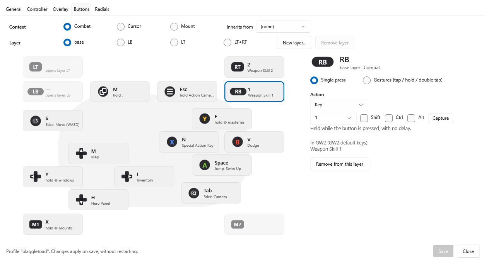

# TyriaPad

Controller support for Guild Wars 2 with a ConsolePort-style glyph overlay, built for the ROG Ally X.

- **Non-invasive**: it installs no drivers, doesn't create a virtual controller and doesn't hide the real one. Deleting the folder uninstalls it.
- **Only acts while GW2 is in the foreground** and the chat is closed.
- **1 press = 1 action**, no macros, per ArenaNet's policy. It doesn't read the game's memory.

> Status: version 0.1.0 (phase 6: settings window with a visual editor, start with Windows and a portable release). Works on the Windows desktop and, by reading the controller through Raw Input, in the Xbox full screen experience (tested on the Ally X; the LT+RT layer isn't available there). See [PLAN.md](PLAN.md).

## Installation

Download the release .zip, extract it to a folder and open `TyriaPad.exe` (no need to install .NET). It shows up in the tray: double-click it to open the settings. To uninstall, turn off "Start with Windows" if you turned it on and delete the folder. Since the executable isn't signed, SmartScreen may warn you the first time ("More info" → "Run anyway").

In GW2, set the game to Windowed Fullscreen and bind a key to "Toggle Action Camera" (`,` by default). On the Ally X, put Armoury Crate SE in Gamepad mode and turn off Steam Input for GW2 (see [docs/armoury-crate-se.md](docs/armoury-crate-se.md)).

## Settings

Tray → **Settings…** (or double-click the icon) opens a window with five tabs: **General** (profile, Action Camera key, GW2 keybinds, startup), **Controller** (camera and cursor sensitivity and curve, deadzones, triggers, gesture timings), **Overlay**, **Buttons** and **Radials**. In **Buttons** you pick a context (combat, cursor, mount) and a layer (base, LB, LT, LT+RT or a new one), tap a button on the controller drawing and assign it an action, or tap/hold/double tap, without writing profile syntax. Each button also shows what that key does in GW2 according to your keybinds. Tapping L3/R3 also lets you choose what the stick does. Nothing is applied until **Save**; then TyriaPad reloads the configuration right away. The default profile is never overwritten: the first time, it's saved as a new profile with the name you choose. The window fits the Ally's 7" screen and works well with touch.



**Start with Windows** (in General or in the tray) creates a shortcut in the Windows Startup folder, without touching the registry. While GW2 is closed, TyriaPad stays idle: it reads the controller once per second and uses almost nothing. **Close TyriaPad when GW2 closes** is for people who open it by hand before playing; it doesn't apply when it was started with Windows.

## Configuration files

On startup, TyriaPad creates `config.json` (settings: sensitivity, gestures, Action Camera key, overlay) and `profiles/blaggletoad.json` (what each button does in each context and layer) next to the executable. Both can be edited while the program is running: they reload on their own, and if there's an error you get a tray notification and a line in `tyriapad.log` without losing the previous configuration. The format is documented in comments in the files themselves; the default profile is the one in [docs/reference-layout.md](docs/reference-layout.md). The settings window writes to `config.json` only what you change and keeps its comments; the profiles it saves have no comments.

## Overlay

With GW2 in the foreground (windowed or Windowed Fullscreen), TyriaPad draws the button that triggers each skill on top of it, dims the layers that aren't active and highlights the one being held (LB, LT, LT+RT). The radial menus (mounts, masteries, windows) and a mode indicator (camera / cursor / mount) are drawn there too. The overlay lets clicks through and hides when GW2 loses focus, while typing in chat, with the map open and on loading screens.

The bar's position depends on the resolution and GW2's interface size; if the glyphs don't line up, go to tray → **Calibrate overlay…** and drag the markers onto slots 1, 5 and 10 and onto F1 and F2. It's saved in `calibration.json`. To see it without opening the game: `TyriaPad.exe --overlay-preview`.

## GW2 keybinds

TyriaPad reads the keybinds XML that GW2 **exports** to `Documents\Guild Wars 2\InputBinds` to know what each key does in the game. That way the glyphs follow the skills even if you move them to other keys. It also warns about anything that doesn't match: profile keys that do nothing in the game, skills with no key or no button, the left stick turning instead of strafing, or an Action Camera key different from the one in `config.json`. GW2 applies key changes immediately but saves them in `Local.dat`, not in that XML, so **after changing a bind you have to export again**; TyriaPad reloads the file right away. The warnings go to the log and to tray → **Check GW2 keybinds** (which also rereads the file). In `config.json`, `inputBinds` picks the file (empty = the most recently exported one, `"none"` = assume the default keys).

## Building

Requires the .NET 10 SDK.

```bash
dotnet build
dotnet test
```

Portable release (tests, publish and `artifacts/TyriaPad-v<version>-win-x64.zip` with its SHA-256):

```powershell
powershell -ExecutionPolicy Bypass -File scripts\publish.ps1
```

The .zip contains `TyriaPad.exe` (self-contained, with .NET inside) and the 5 native WPF DLLs next to it, so .NET doesn't extract them to `%TEMP%`. When a `vX.Y.Z` tag is pushed to GitHub, `.github/workflows/release.yml` does the same and creates the release with the notes from `docs/releases/vX.Y.Z.md`.

Diagnostics: `tyriapad.log` (tray → "Open log") records a heartbeat every 10 s with the state and the process's CPU and memory. `TyriaPad.exe --overlay-preview` shows the overlay without GW2, `--overlay-snapshot <folder>` and `--settings-snapshot <folder>` save the overlay and the settings tabs as PNGs, `--hid-probe` / `--gameinput-probe` / `--rawinput-probe` are the controller reading tests, and `--xbox-probe` bundles the Xbox mode ones (GameInput with background input, Raw Input and the sample overlay).

## Documentation

- [PLAN.md](PLAN.md): architecture and phases
- [docs/reference-layout.md](docs/reference-layout.md): default controller layout (based on Blaggletoad's)
- [docs/gw2-inputbinds-format.md](docs/gw2-inputbinds-format.md): format of the GW2 keybinds XML
- [docs/armoury-crate-se.md](docs/armoury-crate-se.md): how to set up Armoury Crate SE to use it with TyriaPad

## Legal notice

TyriaPad is a fan project and is not affiliated with or endorsed by ArenaNet or NCSOFT. Guild Wars 2 is a registered trademark of NCSOFT Corporation.

## License

[MIT](LICENSE)
